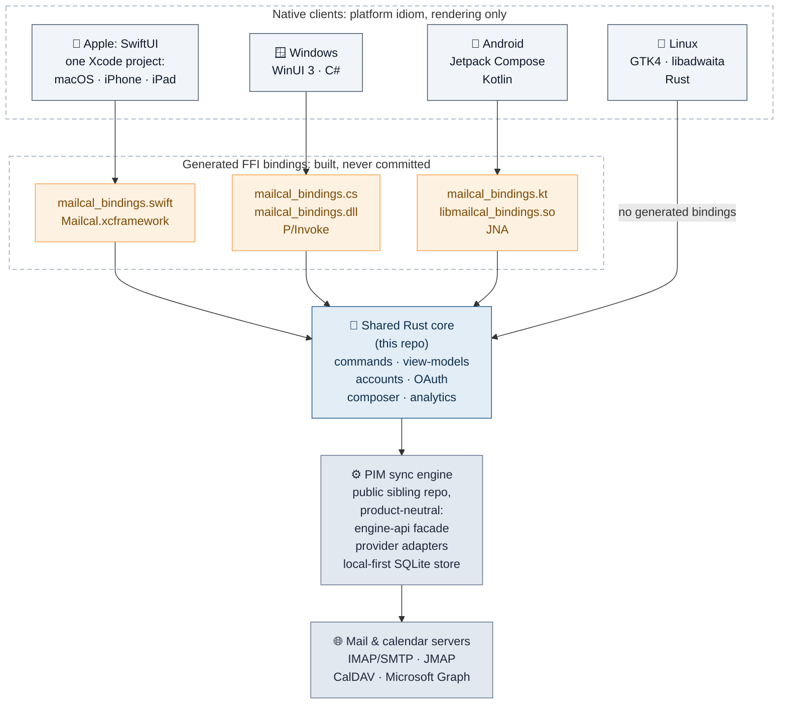
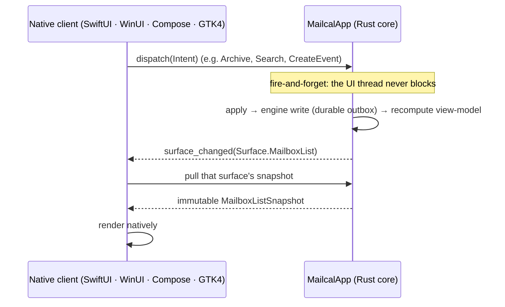
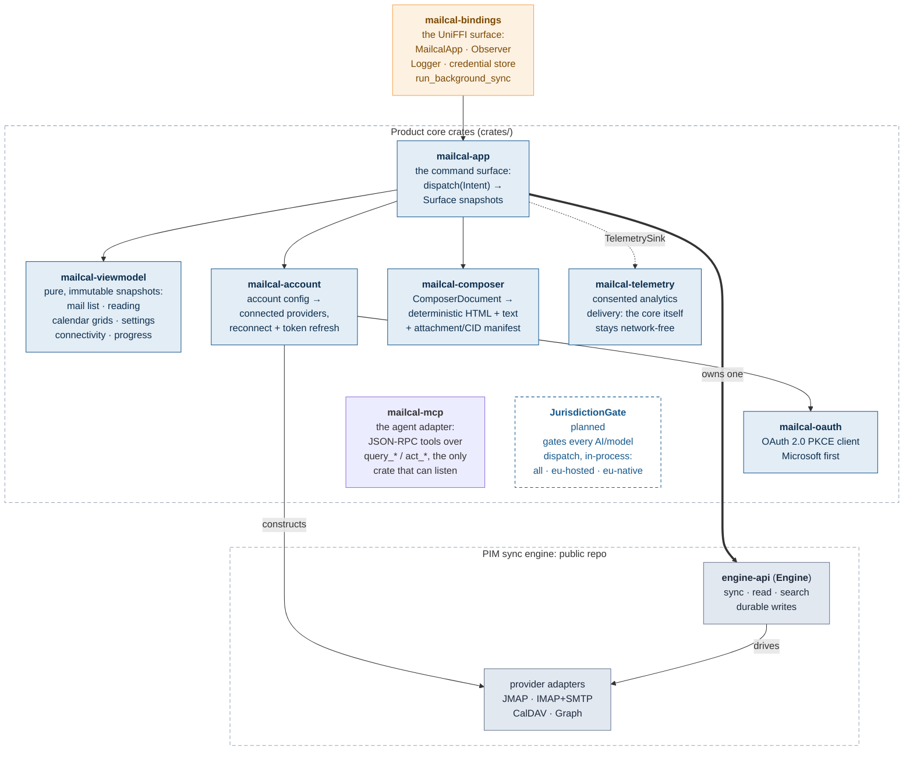
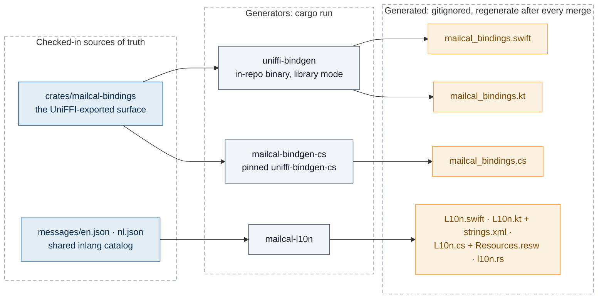

# Architecture: how Allodia Mail & Calendar fits together

The onboarding map for this repo: where product logic lives, how the native clients stay thin,
and how the shared core drives the sync engine.

## The 30-second picture

One rule explains most of this repo: **all product logic is Rust, written once; each client is a
thin native renderer.** A feature lands in the shared core first, crosses the FFI as data, and
every platform then ships it with a small wiring change.

Linux is itself Rust, so it depends on `mailcal-bindings` as an ordinary crate
([`../clients/linux/Cargo.toml`](../clients/linux/Cargo.toml)) and no FFI bindings are generated for
it; the three others reach the same surface through UniFFI.

All four clients also share one non-Rust asset: the rich-composer editor page
([`../clients/composer/dist/editor.html`](../clients/composer/dist/editor.html)), bundled into each app and
governed by [`composer-security.md`](composer-security.md).

## The reactive loop: dispatch → snapshot

Every feature on every platform runs the same unidirectional loop. The client never mutates
state: it fires an `Intent` at the core, gets woken by one callback, and pulls an **immutable
snapshot** of the surface it renders.

The `Intent` enum ([`crates/mailcal-app/src/protocol.rs`](../crates/mailcal-app/src/protocol.rs))
is the **single command surface**: the UI, the local MCP server ([`mcp.md`](mcp.md)) and AI
orchestration are all adapters over the same intents, with one deliberate asymmetry the MCP
adapter introduced: **writes** are intents, **reads** are not, because every read-shaped intent
also moves the user's screen (and `OpenMessage` marks the message read on the server), so the
agent read path is the stateless `query_*` layer instead. Large content (message bodies, attachments) crosses the FFI
as file-URL handles, not byte blobs.

## Inside the core: the crate map

Reading the map:

- **`mailcal-app`** owns one `engine_api::Engine` shared across accounts and is the only place
  behaviour "happens". Everything it exposes is a snapshot; everything it accepts is an `Intent`.
- **`mailcal-viewmodel`** is pure projection: no runtime, no FFI, and the one crate that
  consumes the engine strictly through `engine-api`. `mailcal-account` deliberately reaches the
  concrete `provider-*` crates: the engine's facade design has the *host* construct providers and
  hand them in.
- **`mailcal-telemetry`** exists so demo, test, and air-gapped builds structurally cannot phone
  home. The analytics contract lives in [`analytics.md`](analytics.md).
- **`mailcal-mcp`** is the same argument in the other direction: a build without it structurally
  cannot *listen*. It adds no mail logic (ordering, search scope and write semantics all come
  from `mailcal-app`) and reaches the app through a port `mailcal-bindings` implements, because
  the one thing it needs that the core cannot give it is the host's composer. Its listener modules
  are `#[cfg]`-gated to the desktops, so mobile compiles no socket code at all
  ([`mcp.md`](mcp.md)). `crates/mailcal-mcp-shim` builds `allodia-mcp`, the dependency-free stdio
  relay an MCP client spawns to reach it.
- **`allodia-license`** is the one crate outside the GPL and outside the default build. It lives
  under `allodia_license/`, is source-available under its own licence, and reaches the app as an
  **optional, off-by-default** dependency of `mailcal-bindings`, the same argument as the two
  crates above, since signing in opens sockets. A build without the feature has no Allodia
  sign-in and is a complete mail and calendar client, which `scripts/ci/check-license-dir.sh`
  exists to keep true ([`../allodia_license/entitlement.md`](../allodia_license/entitlement.md),
  [`pledge.md`](pledge.md) promise 4).
- **`JurisdictionGate`** is not yet in code. The sovereignty rule it will enforce is stated in
  [`../AGENTS.md`](../AGENTS.md) → "Non-negotiables".

## What each platform plugs in: the host-service ports

The core calls *up* into a small set of ports each client implements. This table is the whole
per-platform surface a new client has to provide:

| Port | What the core uses it for | Apple | Windows | Android | Linux |
|---|---|---|---|---|---|
| `Observer` | wake the UI: `surface_changed(Surface)` | app shell | app shell | app shell | app shell |
| `Logger` | the rotating, privacy-safe diagnostic file log ([`logging.md`](logging.md)) | `FileLog.swift` | `CoreLogger.cs` | `FileLog.kt` | `logger.rs` |
| `AccountCredentialStore` | secrets in the OS keystore, incl. rotated OAuth tokens (supplied **at construction**, never afterwards) ([`provider-oauth.md`](provider-oauth.md) rule 5) | `KeychainHelper.swift` (Keychain) | `CredentialStore.cs` (Credential Manager) | `SecureStore.kt` (Keystore) | `secrets.rs` (Secret Service, via `oo7`) |
| `run_background_sync` | one bounded headless sync pass while backgrounded ([`background-sync.md`](background-sync.md)) | `BackgroundSync.swift` (BGAppRefreshTask) | desktop live runtime (while the app runs) | `MailSyncWorker.kt` (WorkManager, ~15 min) | desktop live runtime (while the app runs) |
| New-mail notifications | host-raised from the sync pass's returned previews | `MailNotifier.swift` | planned | `MailNotifier.kt` | `ui/notifications.rs` (desktop portal, `ashpd`) |
| OAuth browser leg | capture the PKCE redirect natively | `ASWebAuthenticationSession` | default browser + `eu.allodia.mailcal://` activation | Chrome Custom Tabs + intent-filter | default browser + loopback listener (`ui/oauth_loopback.rs`) |
| Network reachability | feed the OS signal so the core stops dialing while offline | `NWPathMonitor` | `NetworkInformation` | `ConnectivityManager` | GIO `NetworkMonitor` |
| `AgentHostUi` | open an assistant's draft in the client's own composer, **unsent** ([`mcp.md`](mcp.md)) | `AgentComposerBridge.swift` | planned | n/a (no server on mobile) | planned |

## Built, never committed: the codegen boundary

Two generators turn checked-in sources of truth into per-platform artifacts. All of it is
gitignored: after any merge that touches the FFI surface or the message catalog, **regenerate**.
A stale binding fails the client build for reasons that look nothing like the cause
(commands in [`../AGENTS.md`](../AGENTS.md) → "Building & verifying").

Localisation follows the same shape on purpose: the Rust core emits machine-readable data only
(ISO timestamps, structured fields); each client assembles localised copy from its generated
`L10n` artifact. The core has no runtime locale facility.

## Where to go next

- [`README.md`](README.md) (this directory): the cross-platform contracts: rendering and
  composer security, logging, analytics, background sync, OAuth, JMAP.
- [`../README.md`](../README.md) → "Status: platform capability matrix": what each client
  actually ships today.
- The engine's own README (public sibling repo `email-calendar-sync-engine`): the provider
  matrix and the host-facing `engine-api` facade.
