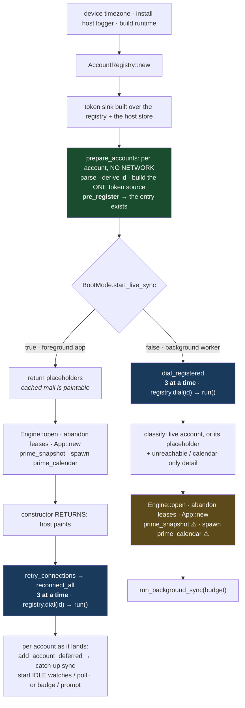
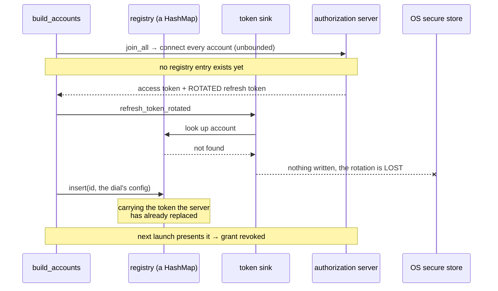

# Boot sequence: the foreground app and the background worker

Both mobile and desktop hosts construct the core twice in a device's life, from two different
places, and the two constructions have different jobs:

| | **Foreground app** | **Background worker** |
|---|---|---|
| Entry point | `MailcalApp::new_accounts` | `MailcalApp::new_background_worker` |
| `BootMode.start_live_sync` | `true` | `false` |
| Who calls it | the app process at launch | Android WorkManager · iOS `BGAppRefreshTask`, when the app is **not** running |
| Lifetime | the session | one bounded pass, then the process is suspended or killed |
| First obligation | paint cached mail **now** | fetch new mail inside the OS's window |

They share one function (`boot::build_accounts`), and that is right: the store, the engine, the
credential path and the account registry must behave identically or the app that reads a mailbox and
the worker that fills it will disagree. What they differ in is **when the network is dialed**, and
that difference is where a two-day-fatal bug lived for a year.

This document draws both, records the invariants boot must not break, and ends with an honest
assessment of whether the shape is right.

---

## The invariants

Four properties. Break any of them and the failure is silent for hours and then permanent.

1. **An account is in the registry before anything dials it.** A dial refreshes, a refresh can rotate
   the refresh token, and the token sink can only re-serialize a rotation into a config it can *find*.
   See [`provider-oauth.md`](provider-oauth.md) rule 5.
   → *Enforced by the type:* `AccountDial`'s only constructor is `AccountRegistry::dial`.
2. **Exactly one token source per account, ever.** Two sources over one refresh token are two
   independent refreshers of one credential, which is the replay a ratcheting server revokes a grant
   for.
   → *Enforced by construction:* `prepare_stored_account` builds it, the registry holds it, and the
   dial `Arc`-clones that one rather than building its own.
3. **Nothing writes a config that was parsed before a dial.** A rotation during the dial has already
   advanced the registry's copy; re-inserting the pre-dial config puts the spent token back.
   → *Enforced by omission:* the registry has no `insert`, and committing a registration writes
   nothing back.
4. **The credential store is live before the first refresh can be.** Hence a constructor parameter
   rather than a setter: a production Android launch measured the first refresh **6 ms** after the
   constructor returned, with the host still blocked inside it.
   → *Enforced by the signature:* there is no setter to forget.

---

## Both modes, after the refactor

They now differ in **one** thing (when the dial happens), which is what `BootMode` always claimed.
Everything before that point is the same code:



The green step is where the invariants are established, for both modes at once. The blue steps are the
same function. ⚠ marks the two steps a background pass cannot read.

### What a dial is now

```mermaid
sequenceDiagram
    participant C as caller<br/>(boot · reconnect · add · re-auth)
    participant R as AccountRegistry
    participant D as AccountDial
    participant AS as authorization server
    participant K as OS secure store

    C->>R: pre_register(id, config + its ONE token source)
    R-->>C: Registered
    C->>R: dial(id)
    Note over R,D: the ONLY constructor of an AccountDial.<br/>No entry → no dial → nothing to run.
    R-->>C: AccountDial (a snapshot; no lock held)
    C->>AS: run() to mint an access token
    AS-->>C: access token + ROTATED refresh token
    C->>R: rotate_refresh_token(id, new)
    R->>K: persist the re-serialized config
    C->>R: commit(Registered)
    Note over R: consumes only the rollback token.<br/>The pre-registered entry stays untouched.
```

### Before: the ordering that killed a real account

Kept because the failure is the reason for every shape above. The headless worker dialed under one
unbounded `join_all` *before* any account was registered, so the sink found no entry, and the loop that
registered them afterwards re-inserted the config the dial had parsed, over the rotation the sink had
managed to persist.



Observed: one cold pass at `07:34:31` dropped exactly two rotations; the account was dead by
`08:39:56`. Microsoft survived the same 70 ms because it leaves a superseded token valid, and Google
does not rotate on a refresh grant at all, so the only provider that could expose this was the only
one that lost an account.

---

## What the refactor changed, and what is left

### Done

| | Before | After |
|---|---|---|
| Assemblers of "open an account of family X" | **4**, over 12 call sites | **1** (`AccountDial::run`) |
| Registry | `Arc<Mutex<HashMap<…>>>` alias; `insert` open to every module | a type with `pre_register` / `commit` / reads; **no** `insert`, no `get_mut` |
| "Registered before dialed" | a rule in a doc, held by four copies independently | a type: `AccountDial` has one constructor, and it reads the registry |
| Writing a stale config back | possible, and done, in two paths | no method exists that can |
| Foreground dial concurrency | sequential: the 5th account waited for 4 logins | 3 at a time |
| Headless dial concurrency | unbounded `join_all`: bursts of 10–11 sockets | 3 at a time |
| `HostConnector`'s own 4-variant enum | a 5th hand-rolled copy | uses the dial snapshot |

### Still open

- The headless pass primes a snapshot and a calendar it cannot read.
- **The engine's connection pool** is what bounds sockets *per account*; three accounts
  × five folders is still 15 until it lands. The core's bound is per **account**, deliberately: the
  socket count of one account is a property of the engine's type, not of this scheduler.
- **`collect_new_inbound` reports cached mail newer than the mark**, whether or not this pass synced
  anything. Not a bug on its face (mail the user was never notified about should not be swallowed),
  but 74 notifications at once is not a design either.

### What is already right, and should not be "improved" away

- **Cached mail is painted before any socket opens.** The foreground boot returns placeholders
  precisely so first paint does not wait on a login; that was the cure for a multi-second
  "Connecting to your account…" wait. Do not let a refactor put the dial back on the critical path.
- **The calendar primes off the boot path.** The mail list is the primary surface and must not wait for
  one the user has not opened.
- **The credential store is a constructor parameter.** Two clients previously installed it from a
  UI-thread post, so whether a rotation was saved depended on whether the main thread had had a turn.
  There is no setter now, and there should never be one again.
- **A dial failure keeps the account.** It stays listed as its placeholder with an outage badge and
  re-dials later, rather than vanishing: the difference between "my server is down" and "the app lost
  my account".

---

## Enforcement

The invariants above are held by the type system where possible, and by tests where not:

- `crates/mailcal-bindings/src/tests_credential_ordering.rs`: the same property on **each of the
  three paths that open an account**: cold background worker, foreground app, `add_account`. Each
  drives the real FFI constructor over a live loopback token endpoint that rotates, with a mail host
  that refuses. All three were watched failing over the old ordering; skipping the registration makes
  the two boot tests fail with *no dial having happened at all*, which is the type gate doing its job.
  They are three tests rather than one on purpose: they share a dial now, but "these paths are the
  same" is exactly what was believed before, and the divergence lived in the path with no test.
- `crates/mailcal-bindings/src/account_registry/tests.rs`: the registry's own rules: no entry means
  no dial; a rotation advances the entry a later persist reads from; `commit` cannot put a
  stale config back; a rollback restores what it displaced rather than deleting a live account.
- `crates/mailcal-bindings/src/tests_credentials.rs`: the store is live before the first refresh can
  be; a failed add leaves no entry; a refusing store fails the add and reports the erase.
- `crates/mailcal-account/src/graph/token_source/tests.rs`: one refresh per account however many
  callers queue, on success *and* on failure, plus the dead-grant memo.

One thing deliberately has no test: that a module **outside** the registry cannot construct an
`AccountDial`. `from_entry` is `pub(super)`, so such a module does not compile, and a test that does
not compile is not a test.
